## Resources
- Leitura Cap 03
- [Video Tutorial](https://www.youtube.com/watch?v=6XrL5jXmTwM)
- [uml online editor](https://plantuml.com/)

## About thew project
implement an aircraft simulation program based on the class diagram provided to you.

## KEYWORDS
keywords | brief |
---------| ----- |
Observer | - |
Singleton| - |
Factory design patterns | - |
UML class diagram | - |
object-oriented design patterns | - |


- Compile o projeto executando os comandos abaixo na raiz da pasta do seu projeto.

```bash
$ find * -name "*.java" > sources.txt
$ javac @sources.txt
```

## UML diagram

### Diagrama
Nome da classe | <--
--|--
Atributos | <--
Métodos | <--

### Visibilidades
- (-) private
- (+) public
- (#) protected
- (~) package/default (quando você não escreve nada)

Modificador | Própria Classe | Mesmo Pacote | Subclasse (Herança) | Mundo (Outros pacotes)
--|--|--|--|--|
public | Sim | Sim | Sim | Sim
protected | Sim | Sim | Sim | Não
default (~) | Sim | Sim | Não | Não
private | Sim | Não | Não | Não

###  Configuração visual do PlantUML

#### `skinparam classAttributeIconSize 0`
- Por padrão, o PlantUML exibe ícones coloridos ao lado dos atributos e métodos das classes para indicar a visibilidade
- `skinparam classAttributeIconSize 0` desativa esses ícones, definindo o tamanho deles como zero.
- Mantendo os símbolos de texto (`+`, `-`, `#`, `~`), deixando o diagrama mais limpo e compacto.

#### `hide empty members`
- Faz com que as seções vazias sejam omitidas, deixando o diagrama mais limpo e compacto.
- Por padrão, o PlantUML renderiza três seções em cada classe — atributos, métodos e uma terceira opcional. 
  - Se uma dessas seções não tiver nada, ele ainda desenha o espaço vazio, deixando o diagrama com "caixas em branco" desnecessárias.


### Notações de relacionamento entre as classes
- WeatherTower  *extends*  Tower          (herança de classe)
- Tower         *agrega*   Flyable        (aggregation — List<Flyable>)
- Aircraft      *extends*  Flyable        (realização — Flyable é abstrata)
- Aircraft      *compõe*   Coordinates    (composition — campo direto)
- Helicopter/JetPlane/Balloon *extends* Aircraft  (herança de classe)

**`<|--` — Herança (extensão)**
```
Tower <|-- WeatherTower
```
`WeatherTower` herda de `Tower`. A seta aponta para a classe pai. É o "é um" — WeatherTower *é uma* Tower.

---

**`-o` — Agregação**
```
Tower -o Flyable
```
`Tower` agrega `Flyable`. O `o` representa o losango vazio do UML. É o "tem um, mas não depende" — Tower mantém uma lista de Flyables, mas eles existem independentemente dela.

---

**`-*` — Composição**
```
Coordinates -* Aircraft
```
`Aircraft` é composto por `Coordinates`. O `*` representa o losango cheio do UML. É o "tem um e controla o ciclo de vida" — se o Aircraft for destruído, as Coordinates também são.

---

**`<|..` — Realização (implementação de interface)**
```
Flyable <|.. Aircraft
```
`Aircraft` implementa/realiza `Flyable`. A linha pontilhada indica que é uma interface ou classe abstrata sendo implementada, não uma herança concreta.

---

**`-[hidden]-` — Relacionamento invisível (apenas para layout)**
```
JetPlane -[hidden]- AircraftFactory
WeatherTower -[hidden]- WeatherProvider
```
Esse é o único que **não tem significado UML**. É um truque do PlantUML para forçar o posicionamento visual — faz o motor de layout colocar as duas classes próximas ou numa mesma linha, sem desenhar nenhuma seta ou linha no diagrama final.

---

**`<<Singleton>>` — Estereótipo**
```
class AircraftFactory <<Singleton>>
```
Os `<<` `>>` definem um estereótipo UML — uma etiqueta que classifica a classe dentro de um padrão ou papel. Não altera a estrutura, apenas adiciona contexto semântico visível no diagrama.

## Subject
**Você pode utilizar as bibliotecas internas (padrão) do Java**, mas não pode usar bibliotecas externas.

Para esclarecer a diferença entre as regras presentes nas instruções gerais:

*   **"Do not use the default package" (Não use o pacote padrão):** Esta regra refere-se exclusivamente à **organização do seu próprio código**. Ela exige que você declare um `package` no topo dos seus arquivos `.java`, em vez de deixar as classes sem pacote.
*   **Bibliotecas Internas vs. Externas:**
    *   **Permitido:** Você pode usar todos os recursos e funcionalidades principais (core features) da linguagem Java até a versão LTS mais recente. Isso inclui bibliotecas que já vêm com o Java (como `java.util.*`, `java.io.*`, etc.).
    *   **Proibido:** Você **não tem permissão** para usar **bibliotecas externas** (como frameworks de terceiros, bibliotecas baixadas do Maven Central, etc.), ferramentas de build (como Maven ou Gradle) ou geradores de código.

Portanto, o uso das ferramentas padrão que já fazem parte do Java Development Kit (JDK) é esperado, desde que o seu próprio código esteja devidamente organizado em pacotes relevantes criados por você.

## Livro
Em resumo, foque nos capítulos dos padrões Observer, Singleton e Factory
estude a notação no Apêndice B e utilize os Capítulos 1 e 2 como fundamentação teórica 
para garantir que o design do seu simulador seja "limpo, fácil de ler e fácil de mudar" conforme exigido pelo projeto

### Padrões mais comuns
*Se você não é um projetista com experiência em software orientado a objetos,
comece com os padrões mais simples e mais comuns:*
- Abstract Factory (pág. 95)
- Adapter (140)
- Composite (160)
- Decorator (170)
- Factory Method (112)
- Observer (274)
- Strategy (292)
- Template Method (301)

## Estrutura de Diretórios

- Existem essencialmente três filosofias.

*Veja como o mesmo projeto hipotético ficaria em cada uma:*


### A estrutura de diretório deste projeto 
*— e por que cada pasta existe*

```bash
simulator/
│
├── Main.java                  ← ponto de entrada, orquestra tudo
│
├── model/                     ← ENTIDADES DE DOMÍNIO
│   ├── Coordinates.java       │  o que o sistema representa
│   ├── Aircraft.java          │  (equivalente ao "model" do MVC,
│   ├── Helicopter.java        │   mas sem ORM/JPA)
│   ├── JetPlane.java          │
│   └── Balloon.java           │
│
├── flyable/                   ← CONTRATO / INTERFACE
│   └── Flyable.java           │  define O QUE toda aeronave deve saber fazer
│                             
│
├── tower/                     ← PADRÃO OBSERVER
│   ├── Tower.java             │  o "subject" que notifica
│   └── WeatherTower.java      │  (é puro design pattern)
│
├── provider/                  ← SERVIÇO SINGLETON
│   └── WeatherProvider.java   │  lógica isolada de geração de clima
│                              │  (análogo ao "service" do MVC, mas sem injeção)
│
└── factory/                   ← PADRÃO FACTORY
    └── AircraftFactory.java   ← cria objetos sem expor o "new"
                               │ (é puro OOP pattern)
```

Neste caso estrutura de diretórios deve espelhar o design do sistema.
Quando o design é orientado a padrões OOP (Observer, Factory, Singleton),
as pastas devem refletir esses papéis 
— E não camadas técnicas de um framework, que não existe aqui.

Sua correspondência direta:

| Pasta | Origem no UML |
|---|---|
| `model/` | Classes `Aircraft`, `Coordinates`, subtipos |
| `flyable/` | Classe abstrata `Flyable` |
| `tower/` | Classes `Tower` e `WeatherTower` |
| `provider/` | Classe `WeatherProvider <<Singleton>>` |
| `factory/` | Classe `AircraftFactory <<Singleton>>` |

## Análise de UML para organização de diretórios

### A pergunta certa ao olhar um UML

Não é *"o que essas classes fazem?"* — é **"por que essas classes existem juntas?"**

Existem exatamente 4 perguntas que você faz para cada classe ou grupo de classes:



Agora vamos aplicar isso **classe por classe** no UML do projeto. Vou te guiar pelo raciocínio — não pelo resultado.

---

### Passo 1 — leia os estereótipos e modificadores

Antes de qualquer coisa, o UML já te dá pistas visuais explícitas. Olha o que está escrito:

```
WeatherProvider  <<Singleton>>
AircraftFactory  <<Singleton>>
Flyable          abstract
Aircraft         (sem marcador)
Coordinates      (sem marcador)
```

`<<Singleton>>` significa: *existe uma e só uma instância, controlada pela própria classe*. Isso já grita: **essas classes não são entidades de domínio**. Elas têm um papel de infraestrutura/serviço.

`abstract` significa: *nunca será instanciada diretamente — existe para ser herdada*. Isso grita: **ela é um contrato ou base**.

---

### Passo 2 — aplique as 4 perguntas em cada classe

Vamos percorrer juntos:

**`Coordinates`** — *O que ela representa no mundo real?*
Uma posição geográfica com longitude, latitude e height. Só dados, sem comportamento complexo. Resposta: representa algo do domínio → `model/`

**`Aircraft`, `Helicopter`, `JetPlane`, `Balloon`** — *O que elas representam?*
Aeronaves reais. São as entidades centrais do simulador. Resposta: domínio → `model/`

**`Flyable`** — *Ela define um contrato para outras?*
Sim — toda aeronave que voa precisa implementar `updateConditions()` e `registerTower()`. Ela não representa nada do mundo real, só define *o que* qualquer coisa que voa deve saber fazer. Resposta: contrato → `flyable/`

**`Tower` e `WeatherTower`** — *Ela coordena outras classes?*
Sim — `Tower` mantém uma lista de `Flyable` e os notifica quando algo muda. Ela não é uma entidade do domínio (você não pousa num `Tower`), ela *orquestra* o comportamento. Resposta: coordenação → `tower/`

**`WeatherProvider`** — *Ela coordena ou serve dados?*
Ela é um `<<Singleton>>` que fornece dados de clima. Não é entidade, não é contrato, não cria objetos — ela *provê informação*. Resposta: serviço/provider → `provider/`

**`AircraftFactory`** — *Ela cria outras classes?*
Sim — o próprio nome diz. `newAircraft()` recebe um tipo como string e devolve um `Flyable`. Ela existe exclusivamente para instanciar objetos. Resposta: criação → `factory/`

---

### Passo 3 — visualize o resultado do raciocínio



---

## O processo mental resumido em 3 etapas

Toda vez que você olhar um UML, percorra nesta ordem:

**1. Procure os estereótipos** — `<<Singleton>>`, `<<abstract>>`, `<<interface>>`. Eles revelam o *papel* antes de você ler qualquer método.

**2. Agrupe por coesão** — classes que *mudam juntas* ou que *falam entre si* o tempo todo pertencem à mesma pasta. `Tower` e `WeatherTower` se relacionam diretamente; `Helicopter` e `Balloon` compartilham a mesma base. Esse é o sinal.

**3. Nomeie pelo papel, não pelo tipo** — a pasta não se chama `abstracts/` ou `classes/`. Ela se chama pelo papel que aquele grupo exerce no sistema: `tower/` porque coordena, `factory/` porque cria, `model/` porque representa.

---

## 🌤️ Algoritmos de Weather Generation

O único requisito do subject é: **deve levar as coordenadas em conta**. Aqui estão algumas ideias com complexidade crescente:

---

### Opção A — Soma simples (sua implementação atual)
```java
int index = Math.abs(lon + lat + height) % 4;
```
✅ Simples e válido. Problema: coordenadas próximas tendem a ter o mesmo clima.

---

### Opção B — Multiplicação com pesos
```java
int index = Math.abs(lon * 31 + lat * 17 + height * 7) % 4;
```
Distribui melhor — coordenadas próximas geram climas diferentes. Os números primos como multiplicadores são um truque clássico de hash.

---

### Opção C — Baseado em `hashCode()`
```java
int index = Math.abs(
    (coordinates.getLongitude() * 73856093) ^
    (coordinates.getLatitude()  * 19349663) ^
    (coordinates.getHeight()    * 83492791)
) % 4;
```
Inspirado em spatial hashing — técnica usada em jogos para mapear coordenadas 3D a um índice. Os números grandes são primos escolhidos para minimizar colisões.

---

### Opção D — Usando `java.util.Random` com seed
```java
public String getCurrentWeather(Coordinates coordinates) {
    long seed = coordinates.getLongitude() * 1000L
              + coordinates.getLatitude() * 100L
              + coordinates.getHeight();
    Random random = new Random(seed);
    return weather[random.nextInt(weather.length)];
}
```
A mesma coordenada **sempre** gera o mesmo clima (determinístico), mas coordenadas diferentes geram resultados bem distribuídos. `Random` com seed fixa é reproduzível.

---

### Opção E — Zonas climáticas por altitude
```java
public String getCurrentWeather(Coordinates coordinates) {
    if (coordinates.getHeight() > 75) return "SNOW";
    if (coordinates.getHeight() > 50) return "FOG";

    int index = Math.abs(coordinates.getLongitude() * 31
                       + coordinates.getLatitude()  * 17) % 2;
    return index == 0 ? "SUN" : "RAIN";
}
```
Tem lógica de domínio — altitude alta = neve/névoa, altitude baixa = sol/chuva baseado na posição horizontal. Simula zonas climáticas reais.

---

## 💡 Qual escolher?

| Opção | Distribuição | Complexidade | Realismo |
|---|---|---|---|
| A | ⭐ | ⭐ | ⭐ |
| B | ⭐⭐⭐ | ⭐⭐ | ⭐⭐ |
| C | ⭐⭐⭐⭐ | ⭐⭐⭐ | ⭐⭐ |
| D | ⭐⭐⭐⭐ | ⭐⭐ | ⭐⭐⭐ |
| E | ⭐⭐ | ⭐⭐ | ⭐⭐⭐⭐ |

Para o projeto, **Opção D** é a mais elegante — usa a API padrão do Java, é determinística e bem distribuída. **Opção E** impressiona avaliadores por ter lógica de domínio.

Pode até combinar D e E — usar zonas de altitude e dentro de cada zona usar `Random` com seed. Fica a seu critério!

Qual você prefere? Ou seguimos para `AircraftFactory`? 🚀

## Comandos Uteis
```bash
find . -name "*.class"
find . -name "*.class" -type f -delete
javac -d out @sources.txt
javac @sources.txt
find * -name "*.java" > sources.txt
find . -name "*.java" > sources.txt
java -cp out com.faaraujo.avaj.simulator.Simulator
java com.faaraujo.avaj.simulator.Simulator
```