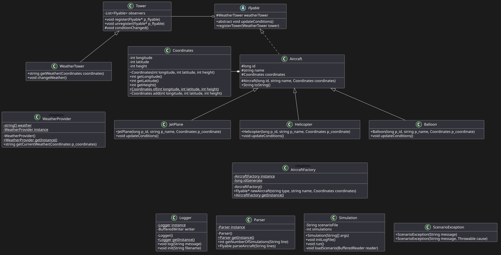

## UML IMAGE

## RoadMap
### Model
1. Coordinates
2. Aircraft
3. Flyable
4. Aircrafts:
  1. Ballon
  2. JetPlane
  3. Helicopter
### Tower
1. Tower
2. WeatherTower
### Provider
1. WeatherProvider
### Factory
1. AircraftFactory
### Utils
1. Logger
2. Parser
### Main
1. Simulator
2. Simulation
### Exceptions
1. ScenarioException

## Volatile
O volatile atua como uma barreira de memória que força o Java a completar toda a construção do objeto antes de permitir que qualquer outra thread veja a variável instance como algo diferente de null.

Curiosidade: Sem o volatile, esse código funcionaria 99% do tempo, mas os 1% de falha seriam bugs extremamente difíceis de reproduzir e debugar!

 - Não: não protege o comportamento interno da classe. Exemplos:
  - [x] Logger: writer pode ser null; log() faz I/O não sincronizado → ainda precisa sincronizar init/log, usar executor ou checar writer atomically.
  - [x] AircraftFactory: ++idGenerate não é atômico → trocar por AtomicLong.incrementAndGet() ou sincronizar criação.
  - [x] Parser: métodos são stateless → DCL é suficiente.
  - [x] WeatherProvider: leitura é segura, mas torne o array weather final/imutável para evitar mutações.

## Aircraft
incrementAndGet() é atômico — elimina races que causavam IDs duplicados sem bloqueios pesados.

## Tower 
implementa o papel clássico de Subject no Observer (publish/subscribe) — é um "Simple Change Manager". Mapeamento:

 - Subject: Tower (mantém observers, register/unregister, notifica).
 - Observer: Flyable (updateConditions é callback).
 - conditionChanged() = notifyObservers().

Cuidados e melhorias

 - Atualmente usa ArrayList e cria snapshot (new ArrayList<>(observers)) antes de iterar — isso evita ConcurrentModificationException na notificação, mas não evita 
races (registro/perda de atualização) nem visibilidade entre threads.
 - Recomendações seguras:
  - Trocar para CopyOnWriteArrayList:
  private final List<Flyable> observers = new CopyOnWriteArrayList<>();
  // então iterar diretamente: for (Flyable f : observers) f.updateConditions();
  - Ou sincronizar register/unregister/conditionChanged (synchronized).
  - Ou usar ConcurrentLinkedQueue e iterar sobre snapshot se necessário.

Outros cuidados: injetar Logger (em vez de chamar singleton) melhora testabilidade e desacoplamento.